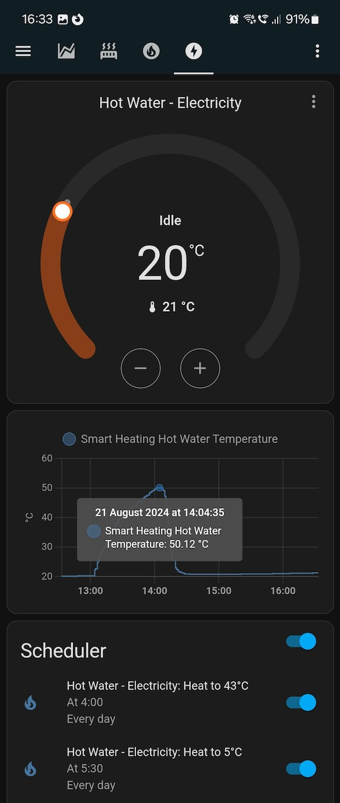
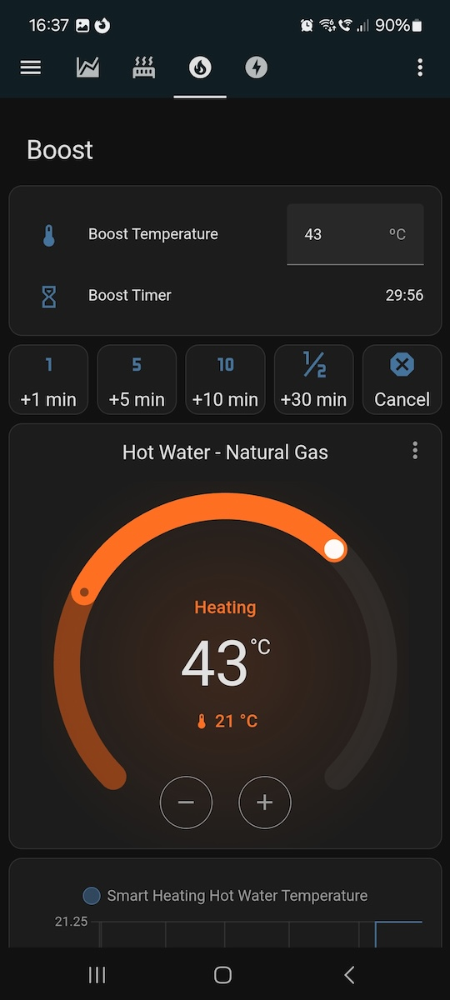
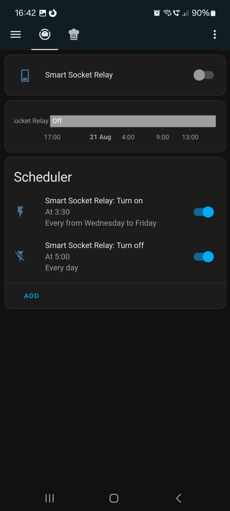

# ‘Oh So Smart’ – An Open Source Smart Device Implementation

- [‘Oh So Smart’ – An Open Source Smart Device Implementation](#oh-so-smart--an-open-source-smart-device-implementation)
  - [Requirements](#requirements)
  - [Configuring Oh So Smart](#configuring-oh-so-smart)
  - [Running Oh So Smart](#running-oh-so-smart)
    - [Manually starting a container](#manually-starting-a-container)
    - [Using the scripts](#using-the-scripts)
  - [Configuring the keep-alive feature](#configuring-the-keep-alive-feature)
  - [Debugging issues](#debugging-issues)
  - [Build your own images, advanced debugging and contributing](#build-your-own-images-advanced-debugging-and-contributing)

A smart device (Plug, Socket, Thermostat …) implementation for [Home Assistant MQTT
discovery](https://www.home-assistant.io/integrations/mqtt/#mqtt-discovery), written in
Python.

<p></p>

Oh So Smart devices are automatically discovered by your local [Home
Assistant](https://www.home-assistant.io/installation/) server configured with the [MQTT
integration](https://www.home-assistant.io/integrations/mqtt/), and can be controlled with
the free Home Assistant companion app for phones / tablets / laptops
([Android](https://play.google.com/store/apps/details?id=io.homeassistant.companion.android),
[iOS](https://apps.apple.com/us/app/home-assistant/id1099568401)) … or any web browser.
Some app screenshots on Android:

<table>
<tr>
<td width="33%" valign="top"></td>
<td width="33%" valign="top"></td>
<td width="33%" valign="top"></td>
</tr>
</table>

Oh So Smart is not a software library. It is a complete Python application that runs on
physical computing devices like the Raspberry Pi, turning them into your own home-made
smart device. Oh So Smart continuously listens for MQTT command messages from Home
Assistant and sends back sensor readings. You can use it as it is, or modify it to suit
your needs — it is free and open source under the [Open Software License](./LICENSE).

Oh So Smart has a configurable, extensible design to accommodate different kinds of smart
devices. Implementations of a **Smart Power Plug/Socket** and a **Smart Thermostat** are
currently provided:

* **Smart Thermostat:** Periodically send temperature readings to Home Assistant, and turn
  a GPIO pin *on/off* under Home Assistant’s control.
  - Noise and outlier filters (with configurable parameters) are applied to temperature
    readings before sending them to Home Assistant, which is particularly helpful when
    low cost sensors* are used.
  - For flexibility, the core thermostat logic (when to turn a heater/cooler *on* or
    *off*) is left to Home Assistant integrations like [Versatile
    Thermostat](https://github.com/jmcollin78/versatile_thermostat/) or [Generic
    Thermostat](https://www.home-assistant.io/integrations/generic_thermostat/), or the
    user’s own custom automations. Versatile Thermostat, for example, implements a fully
    featured smart thermostat with presets, open window detection, occupier presence,
    motion detection, TPI control (time proportional and integral algorithm) and more.
  - For safety, Oh So Smart can be configured to expect the Home Assistant server to
    produce periodic “keep-alive” MQTT messages for each controlled MQTT switch. If these
    messages are missed, Oh So Smart turns the respective GPIO pins off.

* **Smart Plug/Socket:** Multiple GPIO pins are exposed as switch entities for Home
  Assistant to control. Again as in the case of a Smart Thermostat, a configurable
  failsafe feature turns the GPIO pins *off* if keep-alive MQTT messages are missed, or if
  the network connection to the MQTT broker is lost.

In both cases, Home Assistant’s MQTT discovery mechanism automatically creates switch
[entities](https://www.home-assistant.io/getting-started/concepts-terminology/#entities),
e.g. ‘switch.smart_socket_relay’, and in the case of a Smart Thermostat, also sensor
entities, e.g. ‘sensor.smart_thermostat_bedroom_temperature’. You can then use these
entities in your Home Assistant dashboard cards, automations and scripts, or to configure
integrations like [Versatile
Thermostat](https://github.com/jmcollin78/versatile_thermostat/) or the built-in [Generic
Thermostat](https://www.home-assistant.io/integrations/generic_thermostat/). Comprehensive
scheduling functionality can be achieved with the popular [Scheduler
Component](https://github.com/nielsfaber/scheduler-component) + [Scheduler
Card](https://github.com/nielsfaber/scheduler-card) integration and UI.

Oh So Smart use a GitHub Actions [workflow](/.github/workflows/ci.yml) (continuous
integration) to build and publish Docker images to the [GitHub Container
Registry](https://github.com/pdcastro/oh_so_smart/pkgs/container/oh_so_smart) whenever new
releases are published. This makes updates straightforward and offers full transparency
over the build process and artifacts — not just the source code. This is the complete
opposite of what we get when buying commercial proprietary smart devices that rarely focus
on device security and software maintenance, and the main reason why I decided to use “my
own Raspberry Pi” for home automation.

<sub>\* The temperature sensors used in testing were the
[DS18B20](https://www.analog.com/media/en/technical-documentation/data-sheets/ds18b20.pdf)
(possibly unwittingly [counterfeits](https://github.com/cpetrich/counterfeit_DS18B20)!),
which often provided slightly different temperature values in consecutive readings just
seconds apart, e.g. 20.44, 20.50, 20.44, 20.50... Whichever the cause, the software noise
filter gets around it by requiring a minimum change threshold and a majority reading in a
rolling window. Also, sometimes the sensors would produce outlier values such as, for
example, ‘7’ in the sequence 20.44, 7, 20.50... The outlier filter eliminates such
readings by comparing measured values with expected values through linear regression over
a configurable sample window. With these filters in place, the readings seen by Home
Assistant are more consistent and reliable.
</sub>

## Requirements

These instructions use the term ***target device*** to refer to a physical computing
device such as a Raspberry Pi where Oh So Smart will run and control GPIO pins (General
Purpose Input Output).

Home Assistant and the MQTT server ([Mosquitto](https://mosquitto.org)) may run on the
local network or in the cloud. If local, they may run on their own separate machines or on
the target device itself (alongside Oh So Smart), including running in Docker containers:
See [Install Home Assistant
Container](https://www.home-assistant.io/installation/linux#install-home-assistant-container)
and the [‘eclipse-mosquitto’ image on Docker
Hub](https://hub.docker.com/_/eclipse-mosquitto).


So far the only tested target device hardware is the [Raspberry
Pi](https://www.raspberrypi.com), but other hardware running Linux should work as well. Oh
So Smart uses [libgpiod](https://libgpiod.readthedocs.io/) which is an API around the
Linux kernel’s standard support for GPIO pins driven by user-space applications.

The target device’s operating system may in principle be any Linux distribution with an
installation of Docker or compatible container engine or framework such as Podman or
balenaEngine. Minimalistic immutable<sup>1</sup> distros are well suited for running
applications in containers, as the application’s dependencies are installed in Docker
images rather than on the host OS.

As a reference, Oh So Smart (including the deployment scripts) has been tested with the
Linux distributions listed in the following table (in all cases using a Raspberry Pi as
the hardware).

| Linux distro | Immutable<sup>1</sup> | Headless setup<sup>2</sup> | Container system<sup>3</sup> | ‘w1-therm’ driver<sup>4</sup> |
| ------------ | ----------- | --------------- | ---------------- | ------------------ |
| [Raspberry Pi OS Lite](https://www.raspberrypi.com/software/) | No | Yes | Docker | Included |
| [Ubuntu Core](https://ubuntu.com/core) | Yes | No | Docker | Included |
| [Standalone balenaOS](https://www.balena.io/os) | Yes | Yes | [balenaEngine](https://www.balena.io/engine) | Included |
| [Fedora IoT 42](https://fedoraproject.org/iot/) | Yes | No | [Podman](https://podman.io) | [Install notes](docs/fedora-iot/README.md#install-the-w1-therm-kernel-driver-for-ds18b20-sensors) |

<sub>1. _“An immutable Linux distribution has its core system locked as read-only.
Directories such as ‘/usr’, ‘/bin’ or ‘/lib’ cannot be modified. Upgrades are atomic,
applied during a reboot. If an upgrade fails, the system can roll back to its previous
state.”_
([[1]](https://linuxblog.io/immutable-linux-distros-are-they-right-for-you-take-the-test/),
[[2]](https://www.zdnet.com/article/what-is-immutable-linux-heres-why-youd-run-an-immutable-linux-distro/))
</sub>  
<sub>2. Headless means without a computer screen and keyboard. Setup refers to the
installation of an _off-the-shelf OS image downloaded from the distributor’s website_
(as opposed to a custom-built OS image).</sub>  
<sub>3. Oh So Smart’s deployment scripts automatically select ‘balena-engine’ or ‘podman’
if ‘docker’ is not available.</sub>  
<sub>4. The ‘w1-therm’ Linux kernel driver is required for using DS18B20 temperature
sensors.</sub>

See below some notes on configuring these distros for an Oh So Smart target device.

<details>
<summary>Click to expand: Setup notes for Raspberry Pi OS Lite</summary>

[Raspberry Pi OS Lite](https://www.raspberrypi.com/software/) is a conventional
Debian-based ‘mutable’ Linux distribution. The _Lite_ variant does not include a
graphical window environment and is thus well suited for a ‘headless’ installation
(no computer screen or keyboard attached to the Pi).

* WiFi network details, SSH public key authentication and the target device’s hostname can
  be configured with the [Raspberry Pi Imager](https://www.raspberrypi.com/software/) app
  ahead of flashing the SD card. See [Configure SSH without a
  password](https://www.raspberrypi.com/documentation/computers/remote-access.html#configure-ssh-without-a-password).  
  Configuring a hostname with the Raspberry Pi Imager allows you to then run ‘ssh
  \<hostname\>.local’ to open a shell on a headless target device.

* [Docker installation instructions for 32-bit Raspberry Pi OS](https://docs.docker.com/engine/install/raspberry-pi-os/)  
  [Docker installation instructions for 64-bit Raspberry Pi OS](https://docs.docker.com/engine/install/debian/)  
  Do _not_ choose ‘Docker Desktop’ among the installation options in the instructions
  above for two reasons:

  1. Docker Desktop is a graphical application and thus not applicable to the _Lite_
     variant of Raspberry Pi OS.
  2. Using Docker Desktop _on the target device_ would introduce a virtual machine with
     its own Linux kernel, which may prevent access to GPIO pins managed by the host OS
     Linux kernel.

  Instead, I recommend choosing the option _“Install using the apt repository”_
  that installs only Docker Engine and that makes it easier to keep the system updated.

* After installing Docker, follow also the [_Linux post-installation steps for Docker
  Engine_](https://docs.docker.com/engine/install/linux-postinstall/) which allow you
  to run the ‘docker’ command as a regular user without requiring ‘sudo docker’.
  Alternatively, setup SSH public key authentication for the ‘root’ user instead of
  a regular user.

* To use DS18B20 temperature sensors, add the line `dtoverlay=w1-gpio` to the end of the
  following file, then reboot the device:  
  - ‘/boot/firmware/config.txt’ - Raspberry Pi OS **Bookworm (12)** or later
  - ‘/boot/config.txt’ - Raspberry Pi OS **Bullseye (11)** or earlier
</details>

<details>
<summary>Click to expand: Setup notes for Ubuntu Core</summary>

[Ubuntu Core](https://ubuntu.com/core) – A minimalistic, immutable distro with easy
snap-based upgrades.

* Follow the instructions [Install Ubuntu Core with the Raspberry Pi
  Imager](https://ubuntu.com/core/docs/install-with-imager#heading--4), including the step
  [Add Ubuntu SSO details](https://ubuntu.com/core/docs/install-with-imager#heading--4) to
  setup SSH with public key authentication.

* Install Docker with simply ‘sudo snap install docker’. Note that you need to use ‘sudo
  docker’ when running Docker command lines on Ubuntu Core
  ([docs](https://documentation.ubuntu.com/core/how-to-guides/container-deployment/run-a-docker-container/)),
  or log in as the ‘root’ user in the first place. This also means that SSH access should
  be configured for the ‘root’ user so that Oh So Smart’s deployment scripts can run
  ‘docker’ over SSH (when uploading a Docker image from the workstation to the target
  device, or when uploading project files to a running container on the target device).

* To use DS18B20 temperature sensors with Ubuntu Core on a Raspberry Pi, add the line
  `dtoverlay=w1-gpio` to the end of file ‘/run/mnt/ubuntu-seed/config.txt’ and
  reboot the device.
</details>

<details>
<summary>Click to expand: Setup notes for standalone balenaOS</summary>

[Standalone balenaOS](https://www.balena.io/os) (‘standalone’ meaning without
[balenaCloud](https://www.balena.io/cloud)) is another minimalistic, immutable,
container-first Linux distro. A major disadvantage of standalone balenaOS is that OS
upgrades require removing and re-flashing the SD card.
[balenaCloud](https://www.balena.io/cloud) (a subscription service with a free tier)
addresses this disadvantage and offers a web-based management interface for fleets of
devices. However, Oh So Smart would require adaptation to work with balenaCloud’s ‘balena
push’ development workflow (mainly the addition of a ‘docker-compose.yml’ file).

* [Download the OS image](https://www.balena.io/os) and flash it to an SD card
  with [Etcher](https://etcher.balena.io).

* WiFi network access is configured by editing a NetworkManager profile file in the
  ‘system-connections’ folder of the SD card’s VFAT partition that can be accessed by
  attaching the SD card to a Windows, macOS or Linux workstation. There is a README and a
  sample profile in that folder. On a running target device, that folder can be found at
  ‘/mnt/boot/system-connections/’.

* Edit [config.json](https://docs.balena.io/reference/OS/configuration/) (‘sshKeys’ entry)
  to setup SSH with public key authentication. The ‘config.json’ file can be found in the
  VFAT partition of the SD card. On a running target device, the file can be found at
  ‘/mnt/boot/config.json’.

* balenaOS comes with [balenaEngine](https://www.balena.io/engine) pre-installed, which is
  compatible with the Docker Engine. Oh So Smart deployment scripts automatically select
  ‘balena-engine’ if ‘docker’ is not available.

* To use DS18B20 temperature sensors with balenaOS on a Raspberry Pi, add the line
  `dtoverlay=w1-gpio` to the end of file ‘/mnt/boot/config.txt’ and reboot the device.

* If you decide to use standalone balenaOS without balenaCloud, you may wish to disable
  the [balena Supervisor](https://docs.balena.io/reference/supervisor/supervisor-api/)
  with the following commands:
  ```sh
  $ mount -o remount,rw
  $ systemctl stop balena-supervisor
  $ systemctl mask balena-supervisor
  $ mount -o remount,ro
  ```
</details>

<details>
<summary>Click to expand: Setup notes for Fedora IoT 42</summary>

[Fedora IoT](https://fedoraproject.org/iot/download) - Another minimalistic, immutable,
container-first distro.

* WiFi network details and SSH public key authentication can be configured through a
  ‘config.bu’ Butane configuration file. See [Fedora IoT install
  notes](docs/fedora-iot/README.md) for a sample file and additional information.

* Fedora IoT ships with [Podman](https://podman.io) whose command line interface is
  compatible with Docker. The Oh So Smart deployment scripts automatically select ‘podman’
  if ‘docker’ is not available.

* To use DS18B20 temperature sensors with Fedora IoT 42 on a Raspberry Pi, first you
  need to install the ‘w1-therm’ kernel driver as described in [_Install the w1-therm
  kernel driver for DS18B20
  sensors_](docs/fedora-iot/README.md#install-the-w1-therm-kernel-driver-for-ds18b20-sensors).
  Then add the line `dtoverlay=w1-gpio` to the end of file ‘/mnt/boot/efi/config.txt’
  and reboot the device.
</details>


## Configuring Oh So Smart

Oh So Smart is configurable through a [TOML](https://toml.io/) configuration file.
Examples with rich comments can be found in the ‘sample_config’ folder:

* [smart_thermostat.toml](sample_config/smart_thermostat.toml)
* [smart_socket.toml](sample_config/smart_socket.toml)

Copy one of the files and edit it according to your environment. The file needs to be
transferred to the target device.

Watch out that some sections like `[product]` use single brackets, while other sections
like `[[switch_groups]]` use double brackets. The latter is TOML’s syntax for an [“array
of tables”](https://toml.io/en/v1.0.0#array-of-tables). Getting the brackets wrong results
in some puzzling error messages from the file parser and validator. 😊

There is a separate section for [Configuring the keep-alive
feature](#configuring-the-keep-alive-feature).

## Running Oh So Smart

Using the multi-platform Docker images published to the [GitHub Container
Registry](https://github.com/pdcastro/oh_so_smart/pkgs/container/oh_so_smart) is the
quickest way to get started, so this approach is documented first. (Alternatively,
instructions for building your own images can be found in the
[Contributing](/CONTRIBUTING.md) file.)

### Manually starting a container

Before introducing the scripts, let’s start by running Oh So Smart “manually” with a long
command line. This should give you an idea of what is involved, and help with solving
issues.

Run the following commands on the target device — either over the network on a SSH shell
prompt, or using a keyboard and monitor connected to the device. Point the `CONFIG_FILE`
variable to the [TOML configuration file](#configuring-oh-so-smart) that you have already
edited and transferred to the device.

```sh
# Start a new Oh So Smart container. The backslash at the end of each line
# indicates that the command line continues on the next line.
CONFIG_FILE='/root/smart_thermostat.toml'
docker run --name smart_thermostat --device=/dev/gpiochip0 --env DEBUG \
  --detach --restart=unless-stopped --security-opt label=disable \
  --init --volume="${CONFIG_FILE}":/data/smart_thermostat.toml \
  ghcr.io/pdcastro/oh_so_smart --config-file=/data/smart_thermostat.toml

# Check the Docker container logs.
docker logs -f smart_thermostat

# To gracefully stop and remove the container
docker stop smart_thermostat && docker rm smart_thermostat
```

‘docker’ may be replaced with ‘podman’ or ‘balena-engine’ as needed, e.g. on Fedora IoT or
balenaOS respectively.

The ‘--restart=unless-stopped’ option tells Docker (or Podman or Balena Engine) to
automatically restart the container when the device reboots. It will not be automatically
restarted if it is manually stopped or removed.

That’s it. If all went well, Home Assistant will automatically discover the MQTT entities
of your new smart device! 🎉 But that long ‘docker run’ command line belongs in a script,
so keep reading.

### Using the scripts

The [scripts](/scripts/) folder in this repository contains a few handy scripts that
automate ‘docker’ command lines such as ‘docker run’ and ‘docker build’, taking all
required parameters from the TOML configuration file. The scripts are also included in the
Docker images for convenience, but they need to be executed on the “host OS” (outside the
container), as their purpose is to run the container or build and transfer Docker images.

Run the following commands to copy the scripts from the Docker image to the host OS for
execution.

```sh
# Copy the ‘scripts’ folder from the Docker image to e.g. ‘/tmp/’.
# Replace ‘docker’ with ‘podman’ or ‘balena-engine’ as needed.
docker cp $(docker create ghcr.io/pdcastro/oh_so_smart):/oh_so_smart/scripts /tmp/

# Run the Oh So Smart container on the target device. Performance hint: Replace
# ‘docker.sh’ with ‘docker.py’ if the host OS has a ‘python3’ interpreter.
# Use the ‘--help’ option for documentation on the available options.
/tmp/scripts/docker.sh -c smart_thermostat.toml run

# Clean up the temporary container used to copy the scripts.
docker container prune
```

The ‘docker create’ command automatically downloads the image as needed, and then creates,
but does not execute, a temporary container that allows for the ‘docker cp’ command to
extract the scripts folder. ‘docker container prune’ then deletes the temporary container.

The scripts may be copied to a better location than ‘/tmp/’, like a home directory. The
scripts will log the executed ‘docker’ command lines for information and debugging.

To check the container logs or to stop and remove the container, use the same commands
mentioned in the previous section.


## Configuring the keep-alive feature

Oh So Smart has a failsafe switch off feature that turns off the controlled GPIO pins if
communication with the Home Assistant server is interrupted for longer than a configurable
period. The feature is implemented by monitoring keep-alive MQTT messages that the Home
Assistant server sends periodically to the target device (the device that runs Oh So
Smart).

To use this feature, it should be enabled on both Oh So Smart’s side and on Home
Assistant’s side. On Oh So Smart’s side, the feature is enabled by setting the
`keep_alive_timeout_sec` attribute of the `[[switch_groups]]` section of the [TOML
configuration file](#configuring-oh-so-smart) to an integer value greater than zero.

On Home Assistant’s side, some integrations like [Versatile
Thermostat](https://github.com/jmcollin78/versatile_thermostat/) (in its [“over
switch”](https://github.com/jmcollin78/versatile_thermostat/blob/main/documentation/en/over-switch.md#keep-alive)
operation mode) or [Generic
Thermostat](https://www.home-assistant.io/integrations/generic_thermostat/) have a
built-in keep-alive feature:

* Versatile Thermostat’s [built-in keep-alive feature](https://github.com/jmcollin78/versatile_thermostat/blob/main/documentation/en/over-switch.md#keep-alive)
* Generic Thermostat’s [built-in keep-alive feature](https://www.home-assistant.io/integrations/generic_thermostat/#keep_alive)

For such Home Assistant integrations, enable their built-in keep-alive feature as per
their documentation, and there is no need to add any custom Home Assistant automation.

For Home Assistant integrations that do not have a built-in keep-alive feature, such as a
[bare MQTT Switch](https://www.home-assistant.io/integrations/switch.mqtt/) (likely
auto-discovered while Oh So Smart is running), a simple keep-alive
[automation](https://www.home-assistant.io/docs/automation/) such as the one suggested
below can be added to Home Assistant.

<details>
<summary>Click to expand: Add a custom keep-alive automation to Home Assistant</summary>

A custom keep-alive automation periodically refreshes the state of the MQTT switches used
by Oh So Smart by calling the ‘turn_on’ or ‘turn_off’ switch actions *even when the
respective switches are already turned ‘on’ or ‘off’,* as this causes MQTT messages to be
sent to the target device.

The automation can take many forms, and it can be added either through Home Assistant’s
[configuration.yaml](https://www.home-assistant.io/docs/configuration/) file or its web
interface. As an example and reference, the following excerpt could be copied and pasted
to your ‘configuration.yaml’ file, with minor adjustments:

```yaml
automation smart_thermostat_hot_water:
  - alias: Smart Thermostat Hot Water
    triggers:
      - trigger: time_pattern
        hours: "*"
        minutes: "*"
        seconds: "/15"
    conditions:
      - condition: template
        value_template: "{{ is_state('switch.smart_thermostat_hot_water', ['on', 'off']) }}"
    actions:
      - action: "{{ 'switch.turn_' ~ states('switch.smart_thermostat_hot_water') }}"
        target:
          entity_id: switch.smart_thermostat_hot_water
```

* Replace references to “hot water” and “smart thermostat” with names applicable to your
  use case. Perhaps “My Yogurt Maker.” 🙂
* Adjust the [time_pattern
  trigger](https://www.home-assistant.io/docs/automation/trigger/#time-pattern-trigger)
  period as desired. I recommend this period to be less than half the value of the
  `keep_alive_timeout_sec` attribute of the `[[switch_groups]]` section of Oh So Smart’s
  TOML configuration file.

In the example above, the automation triggers every 15 seconds, which would be suitable if
`keep_alive_timeout_sec` was, for example, 35 seconds. Keep-alive messages would be sent
every 15 seconds, and the failsafe switch off would trigger if a keep-alive message was
not received for over 35 seconds.

Note also that the custom automation above is subject to the `condition` that the
‘switch.smart_thermostat_hot_water’ entity has a value of ‘on’ or ‘off’, as opposed to a
value of ‘unknown’, ‘unavailable’ or ‘None’, which could be the case if the target device
was offline or not discovered by Home Assistant. Only when the `time_pattern` triggers
***and*** the condition is satisfied will the ‘switch.turn_on’ or ‘switch.turn_off’
actions be executed on the target entity. This example makes use of [automation
templates](https://www.home-assistant.io/docs/automation/templating/) and dynamically
computes the action name using Jinja’s ‘~’ [string concatenation
operator](https://jinja.palletsprojects.com/en/stable/templates/#other-operators).

Watch out that indentation (the number of leading blank spaces on each line) is critical
in YAML files, and don’t forget to restart Home Assistant after changes are made to
‘configuration.yaml’.
</details>

## Debugging issues

If something is not working as expected, the first step is to look at the container logs
with the ‘docker logs’ command mentioned in [Running Oh So Smart](#running-oh-so-smart).
You can also increase the amount of logged information by running Oh So Smart in debug
mode, as documented below.

<details>
<summary>Click to expand: Run the Oh So Smart application container in debug mode</summary>

```sh
# ‘cd’ to the folder where the script files were copied.
cd scripts

# Run the Oh So Smart container on the target device in debug mode. Performance hint:
# Replace ‘docker.sh’ with ‘docker.py’ if the host OS has a ‘python3’ interpreter.
DEBUG=1 ./scripts/docker.sh -c smart_thermostat.toml run

# Check the Docker container logs. Replace ‘smart_thermostat’ with the
# actual container name, which is the ‘slug’ setting in ‘config.toml’.
# Replace ‘docker’ with ‘podman’ on Fedora IoT or ‘balena-engine’ on balenaOS.
docker logs -f smart_thermostat
```
</details>

For more advanced debugging including tweaks to the source code, see
[Contributing](/CONTRIBUTING.md).


## Build your own images, advanced debugging and contributing

The [Contributing](/CONTRIBUTING.md) file documents several more topics:

- [Build your own images](/CONTRIBUTING.md#build-your-own-images)
- [Advanced debugging](/CONTRIBUTING.md#advanced-debugging)
  - [Manually starting the application](/CONTRIBUTING.md#manually-starting-the-application)
- [Application architecture](/CONTRIBUTING.md#application-architecture)
  - [Application structure and product-specific code](/CONTRIBUTING.md#application-structure-and-product-specific-code)
  - [TOML configuration file format (schema)](/CONTRIBUTING.md#toml-configuration-file-format-schema)
  - [Design choices](/CONTRIBUTING.md#design-choices)
    - [Why TOML and not YAML or JSON?](/CONTRIBUTING.md#why-toml-and-not-yaml-or-json)
    - [Why use containers?](/CONTRIBUTING.md#why-use-containers)
    - [Why a Raspberry Pi? Doesn’t the Pico/ESPHome do the job?](/CONTRIBUTING.md#why-a-raspberry-pi-doesnt-the-picoesphome-do-the-job)
- [Development tips](/CONTRIBUTING.md#development-tips)
  - [‘rsync’ to a running Oh So Smart container](/CONTRIBUTING.md#rsync-to-a-running-oh-so-smart-container)
  - [‘pip install gpiod’ on Windows or macOS](/CONTRIBUTING.md#pip-install-gpiod-on-windows-or-macos)
- [Submitting a pull request](/CONTRIBUTING.md#submitting-a-pull-request)
